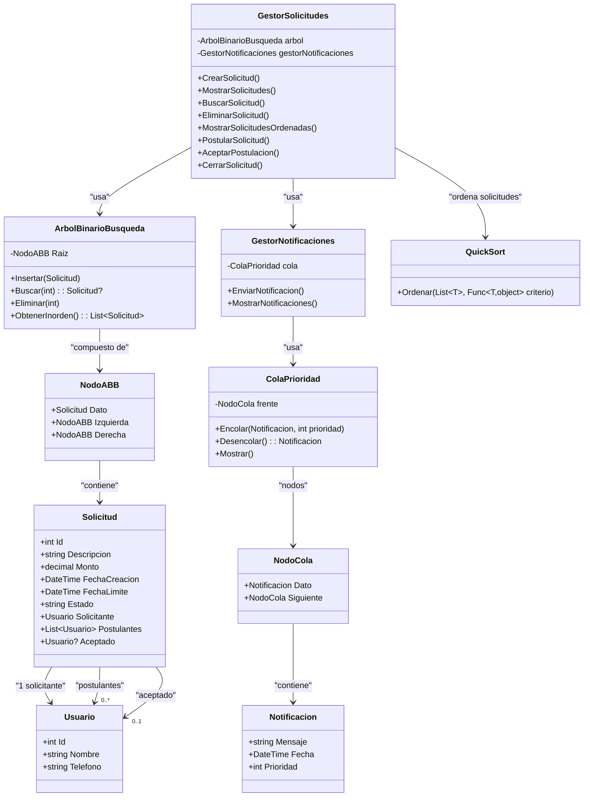
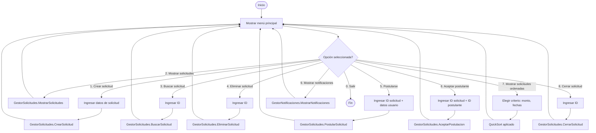
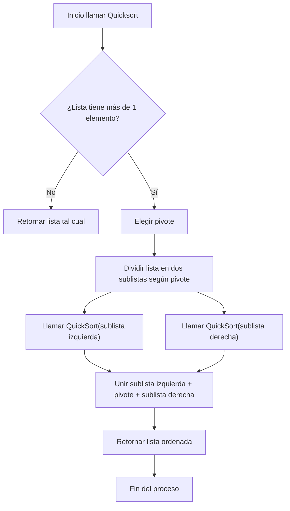

**INDICE**
- [Proyecto: Sistema de Gestión de Peticiones Sociales](#proyecto-sistema-de-gestión-de-peticiones-sociales)
  - [1. Requisitos previos](#1-requisitos-previos)
    - [1.1.  Iniciar sesión en Github](#11--iniciar-sesión-en-github)
    - [1.2. Instalación de Git](#12-instalación-de-git)
    - [1.3. Instalación de VS Code](#13-instalación-de-vs-code)
    - [1.4. Instalación Dotnet](#14-instalación-dotnet)
  - [2. Pasos para crear la carpeta y repositorio local](#2-pasos-para-crear-la-carpeta-y-repositorio-local)
    - [2.1. Abre Git Bash y crea la carpeta del proyecto:](#21-abre-git-bash-y-crea-la-carpeta-del-proyecto)
    - [2.2. Inicia git](#22-inicia-git)
    - [2.3. Configura tu nombre y correo este debe coincidir con el de tu cuenta de GitHub:](#23-configura-tu-nombre-y-correo-este-debe-coincidir-con-el-de-tu-cuenta-de-github)
    - [2.4. Crea un archivo Inicial](#24-crea-un-archivo-inicial)
    - [2.5. Guarda los cambios en Git](#25-guarda-los-cambios-en-git)
    - [2.6. Verfica el estado](#26-verfica-el-estado)
    - [2.7. Subir los cambios](#27-subir-los-cambios)
  - [3. Crear repositorio remoto en GitHub](#3-crear-repositorio-remoto-en-github)
  - [4. Generar y agragar clave SSH a GitHub](#4-generar-y-agragar-clave-ssh-a-github)
    - [4.1. Generar clave SSH](#41-generar-clave-ssh)
    - [4.2. Levantar al agente SSH y agregar una clave](#42-levantar-al-agente-ssh-y-agregar-una-clave)
    - [4.3. Copiar la clave publica](#43-copiar-la-clave-publica)
    - [4.4. Agregar la clave a GitHub](#44-agregar-la-clave-a-github)
  - [5. Pasos para clonar un repositorio existente](#5-pasos-para-clonar-un-repositorio-existente)
      - [5.1. Copiar la URL desde GitHub (Code → SSH o HTTPS).](#51-copiar-la-url-desde-github-code--ssh-o-https)
      - [5.2. En la carpeta donde lo guardarás:](#52-en-la-carpeta-donde-lo-guardarás)
      - [5.3. Ejecutar](#53-ejecutar)
      - [5.4. Entra a la carpeta](#54-entra-a-la-carpeta)
  - [6. Crear y usar ramas](#6-crear-y-usar-ramas)
    - [6.1. Ver ramas existentes](#61-ver-ramas-existentes)
    - [6.2. Crear e ingresar a la rama](#62-crear-e-ingresar-a-la-rama)
    - [6.3. Cambiar a la nueva rama](#63-cambiar-a-la-nueva-rama)
    - [6.4. Hacer cambios y confirmarlos](#64-hacer-cambios-y-confirmarlos)
    - [6.5. Subir la rama a github](#65-subir-la-rama-a-github)
  - [7. Crear y ejecutar un proyecto en C#](#7-crear-y-ejecutar-un-proyecto-en-c)
    - [7.1. Subir cambios a GitHub](#71-subir-cambios-a-github)
  - [8. Desarrollo del proyecto](#8-desarrollo-del-proyecto)
    - [8.1. Descripción General](#81-descripción-general)
    - [8.2 Estructura y convención de nombres](#82-estructura-y-convención-de-nombres)
    - [8.3. Estructuras de Datos Utilizadas](#83-estructuras-de-datos-utilizadas)
    - [8.4. Lógica del Programa](#84-lógica-del-programa)
    - [8.5. Algoritmo QuickSort](#85-algoritmo-quicksort)
    - [8.6. Recursividad](#86-recursividad)
    - [8.7. Diagrama de clases](#87-diagrama-de-clases)
    - [8.8. Diagrama de flujo](#88-diagrama-de-flujo)

# Proyecto: Sistema de Gestión de Peticiones Sociales


A continuación se te presentará una guía indicando el paso a paso que se llevo para crear y configurar el repositorio para el proyecto.

Antes de continuar, cabe aclarar que el equipo para el desarrollo del proyecto decidio trabajar en el lenguaje de C# y con el editor de codigo Visual Studio Code. Ante ello se mostrará la configuración de los mismos.

## 1. Requisitos previos 

### 1.1.  Iniciar sesión en Github
- Crear una cuenta en Hithub
- Inicia sesión en el navegador
  
### 1.2. Instalación de Git
- Descarga Git: **[Download Git](https://git-scm.com/downloads)**

  - *Puedes descargalo para Windows o para el sistema operativo de tu prefrencia*
- Acepta todos los términos
- Realiza la instalación
- Abre git bash y verifica la instalación
  

---


<pre> git --version </pre>

---


### 1.3. Instalación de VS Code

- Descarga VS Code: **[Download VS Code](https://code.visualstudio.com/download)**

- Acepta todos los terminos 
- Realiza la instalción
- Verifica la instalción en git bash:
---


<pre> code --version </pre>

---

### 1.4. Instalación Dotnet

Como estamos trabajando con C#, el mismo amerita esta instalación.

- Descargar Dotnet: **[Download Dotnet](https://dotnet.microsoft.com/en-us/download)**
  
  - .NET 9.0 → Este es compatible solo con ciertas versiones de VS Code.
  - NET 8.0 → Se recomienda este por ser más estable.
  - Elije el que mejor se adapte a ti.

- Acepta todos los términos
- Realiza la instalación.

- En git bash verifica la instalacion:
  
---

<pre> dotnet --version</pre>

---

- Instala la  extension:

  - C# Dev Kit 
  - Este te ayuda con el autocompletado y la depuración sin complicarte.
  
## 2. Pasos para crear la carpeta y repositorio local

### 2.1. Abre Git Bash y crea la carpeta del proyecto:

---

<pre>mkdir estructura-datos-grupo1

cd estructura-datos-grupo1</pre>

---
### 2.2. Inicia git

---

<pre>git init</pre>

---

### 2.3. Configura tu nombre y correo este debe coincidir con el de tu cuenta de GitHub:

---

<pre>git config user.name "Isabel-0106"
git config user.email "quisperamosisasbelalejandra@.com"</pre>

---

### 2.4. Crea un archivo Inicial

---

<pre>echo "# Mi primer proyecto" > README.md</pre>

---

### 2.5. Guarda los cambios en Git

---

<pre>git add README.md
git commit -m "Primer commit"
</pre>

---

### 2.6. Verfica el estado 

---

<pre>git status</pre>

---

### 2.7. Subir los cambios
---
<pre>git push origin master</pre>

---

## 3. Crear repositorio remoto en GitHub

- En GitHub, haz clic en New Repository.

- Nómbralo igual que tu carpeta local (opcional).

- No marques la opción Add a README file.

- Clic en Create Repository.
  
---

## 4. Generar y agragar clave SSH a GitHub

### 4.1. Generar clave SSH

---

<pre>ssh-keygen -t ed25519 -C "tu_correo_de_github@hotmail.com"
</pre>

---

### 4.2. Levantar al agente SSH y agregar una clave

---

<pre>eval "$(ssh-agent -s)"
ssh-add ~/.ssh/id_ed25519
</pre>

---

### 4.3. Copiar la clave publica

---

<pre>cat ~/.ssh/id_ed25519.pub</pre>

---

**_¡¡¡Copia todo el texto!!!_**

---

### 4.4. Agregar la clave a GitHub

  - Ve a **[GitHub → Settings → SSH and GPG keys](https://github.com/settings/keys)**
  - Click en **New SSH key** y pega el contenido y guardalo.

De esa manera se llegó a configurar el repositorio para el proyecto.

---


## 5. Pasos para clonar un repositorio existente

Ahora para que el equipo sea parte del repositorio y se pueda trabajar en conjunto, el que creo el repositorio debe de enviarles una invitación a sus correos.

- Entras al repositorio en github.
- Vas a settings.
- Vas a collaborators.
- Te pedirá un confirmación via email, te enviará un codigo lo ingresasyverificas.
- Vas a add person
- Añades a las personas de tu equipo
- Eso enviará una invitación a sus correos la cual tiene que aceptar.
- Listo ahora si pueden clonarse el repositorio.

#### 5.1. Copiar la URL desde GitHub (Code → SSH o HTTPS).

#### 5.2. En la carpeta donde lo guardarás:
#### 5.3. Ejecutar


---

<pre>git clone URL-de-la-repo
</pre>

---
#### 5.4. Entra a la carpeta
---

<pre>cd nombre-repo
</pre>

---


## 6. Crear y usar ramas
### 6.1. Ver ramas existentes

---

<pre>git branch
</pre>

---

### 6.2. Crear e ingresar a la rama
  ***
  <pre>git checkout -b nombre_de_la_rama
  </pre>

### 6.3. Cambiar a la nueva rama

---

 <pre>git checkout  nombre_rama
</pre>

---

### 6.4. Hacer cambios y confirmarlos

---

 <pre>ggit add .
git commit -m "Mensaje describiendo cambios"
</pre>

---

### 6.5. Subir la rama a github

---

 <pre>git push origin nombre-de-la-rama
</pre>

---

## 7. Crear y ejecutar un proyecto en C#

- Crear una carpeta que vaya a contener el proyecto
- Abre desde la terminal
- En la terminal:

  - `dotnet new console`

- Para ejecutar:

  - `dotnet run`

### 7.1. Subir cambios a GitHub

- Ver estado

---

<pre>git status</pre>

- Agregar todos los cambios

---

<pre>git add .</pre>

- Crear un commit

---

<pre>
git commit -m "mensaje con los cambios realizados"
</pre>

---

- Subir los cambios a GitHub

---

<pre>
git push origin nombre-de-la-rama
</pre>

---

## 8. Desarrollo del proyecto

### 8.1. Descripción General
El sistema permite:
- Crear, buscar, eliminar y cerrar solicitudes.
- Postularse a solicitudes y aceptar postulantes.
- Ordenar solicitudes según monto, fecha de creación o fecha límite.
- Enviar notificaciones simuladas a través de una cola con prioridad.


### 8.2 Estructura y convención de nombres
``` 
├── favorapp/
│── Program.cs # Menú principal y ejecución
│
├── modelos/ # Modelos base
│ ├── usuario.cs
│ ├── solicitud.cs
│ ├── notificacion.cs
│
├── estructuras-datos/ # Implementación de estructuras de datos
│ ├── arbol-binario-busqueda.cs
│ ├── nodo-abb.cs
│ ├── cola-prioridad.cs
│ ├── quickSort.cs
│
├── servicios/ # Lógica de negocio
│ ├── gestor-solicitudes.cs
│ ├── gestor-notificaciones.cs
│
└── README.md                 #Documentacion
```

   * Atributos y Parametros:camelCase
      * Archivos kebab-case
      * Clases y métodos PascalCase
      * Variables y parámetros camelCase

---

### 8.3. Estructuras de Datos Utilizadas
- **Árbol Binario de Búsqueda (ABB):** Almacena las solicitudes, permite búsqueda, inserción, eliminación y recorrido inorden.
- **Cola con Prioridad:** Maneja las notificaciones según importancia.
- **Listas (`List<T>`):** Manejo de postulantes en cada solicitud.
- **Algoritmo QuickSort:** Ordena las solicitudes según el criterio elegido por el usuario.

Con respecto a ello el proyecto implementa tres estructuras principales: Árbol Binario de Búsqueda (ABB) para las solicitudes, Cola de Prioridad para notificaciones, y QuickSort para ordenar. Las listas de C# `(List<T>)` se usan únicamente como contenedores auxiliares para simplificar el manejo interno de datos (ejemplo: postulantes o resultados del recorrido del ABB).”

---

### 8.4. Lógica del Programa
1. El usuario interactúa con el menú principal.
2. Al crear solicitudes, se insertan en el ABB y se genera una notificación.
3. Se pueden mostrar y ordenar solicitudes con QuickSort.
4. Se gestiona la postulación y aceptación de usuarios.
5. Las solicitudes vencidas se detectan automáticamente y cambian a **Expiradas**.
6. Las notificaciones se encolan y procesan en orden de prioridad.

---

### 8.5. Algoritmo QuickSort
QuickSort divide recursivamente la lista de solicitudes en dos sublistas según un **pivote**, hasta que cada sublista tenga un único elemento.  
En el proyecto, se utiliza para ordenar solicitudes por:
- **Monto**
- **Fecha de creación**
- **Fecha límite**

---

### 8.6. Recursividad
Se aplica en:
- **ABB:** inserción, búsqueda, eliminación y recorrido inorden.
- **QuickSort:** división de listas en subproblemas más pequeños hasta resolverlos.
  
---
  
### 8.7. Diagrama de clases




--- 

### 8.8. Diagrama de flujo

* Diagrama de fujo general del programa


---

* Diagrama de flujo del QuickSort 
Este representa cómo se ordena la lista de solicitudes (ya sea por monto, fecha límite o fecha de creación):

